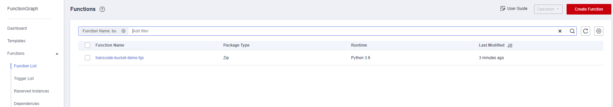
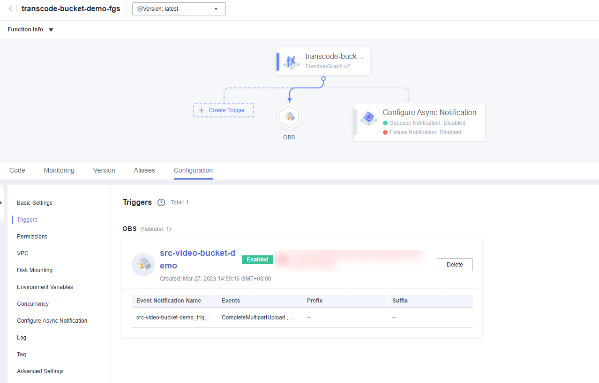
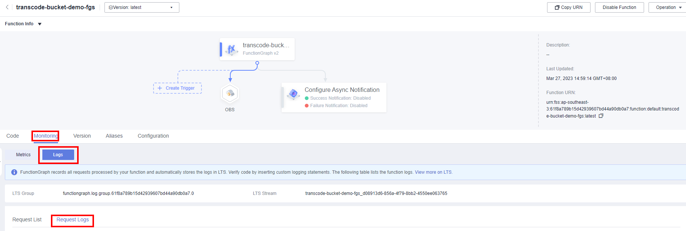
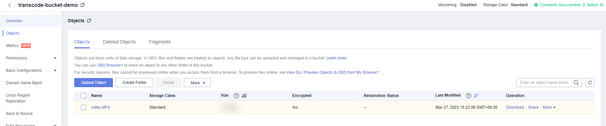

[TOC]

**Solution Overview**
===============
This solution uses a FunctionGraph Object Storage Service (OBS) trigger to transcode video files in an OBS bucket. The transcoding parameters are configured using environment variables.

For more details about this solution, visit: https://www.huaweicloud.com/intl/en-us/solution/implementations/svt.html

**Architecture**
---------------


**Architecture Description**
---------------
This solution will:
- Create two OBS buckets for storing original and transcoded video files, respectively.
- Create an agency in Identity and Access Management (IAM) to delegate FunctionGraph to access video files uploaded to an OBS bucket.
- Create a video transcoding function and an OBS trigger in FunctionGraph.

**File Structure**
---------------
``` lua
huaweicloud-solution-serverless-video-transcoding
├── serverless-video-transcoding.tf.json -- Resource orchestration template
├── functiongraph
    ├── serverless-video-transcoding.py  -- Function file
```
**Getting Started**
---------------
1. Go to the [FunctionGraph console](https://console-intl.huaweicloud.com/functiongraph/?agencyId=f9a6de0674e84d4686ff806fc4eb78e8&region=ap-southeast-3&locale=en-us#/serverless/functionList), and view the created functions in the function list.

	Figure 1 Created function

	

2. On the details page of the function, view the created trigger.

	Figure 2 Video transcoding trigger

	

3. On the Monitoring tab, view the logs of function execution triggered by uploading video files to the bucket that stores the original video files.

	Figure 3 Request logs

	

4. View the transcoded video files in the specified bucket.

	Figure 4 Transcoded video files

	
